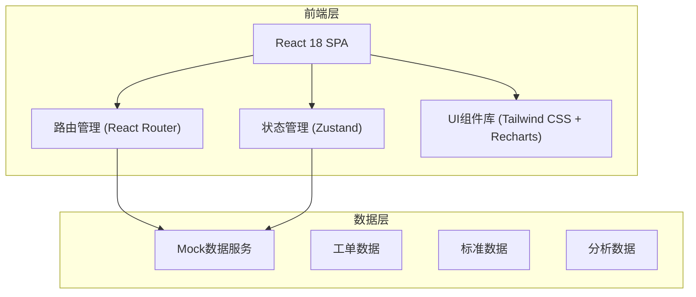
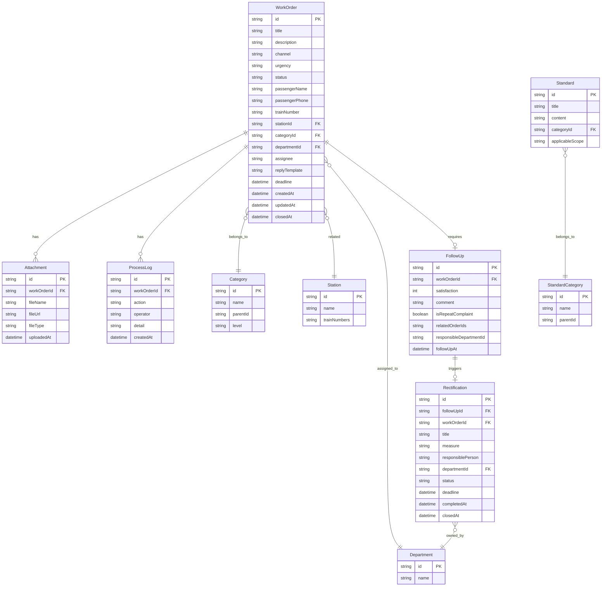

## 1. 架构设计



前端采用 React SPA 单页应用架构，使用 Zustand 进行轻量状态管理，数据层使用本地 Mock 数据模拟后端接口，所有数据操作在前端内存中完成。

## 2. 技术说明

- **前端框架**：React@18 + TypeScript
- **样式方案**：Tailwind CSS@3 + CSS Modules（复杂组件样式隔离）
- **构建工具**：Vite
- **路由**：React Router DOM@6
- **状态管理**：Zustand
- **图表库**：Recharts
- **图标**：Lucide React
- **动画**：Framer Motion
- **后端**：无（使用 Mock 数据）
- **数据库**：无（前端本地 JSON 数据）

## 3. 路由定义

| 路由 | 用途 |
|------|------|
| / | 工单总览页，展示核心指标、状态分布、紧急预警、趋势图表 |
| /channel | 渠道接入页，工单录入、渠道统计、问题分类、车次站点关联 |
| /processing | 工单处理页，待处理列表、受理分派、时限提醒、答复模板 |
| /follow-up | 旅客回访页，回访任务、满意度评分、重复投诉识别 |
| /standards | 服务标准页，标准分类目录、详情查看、关键词检索 |
| /rectification | 整改跟踪页，整改任务列表、创建任务、复核关闭、进度追踪 |
| /analysis | 质量分析页，热点排行、月度报告、趋势分析、部门绩效 |

## 4. 数据模型

### 4.1 数据模型定义



## 5. 项目目录结构

```
src/
├── components/
│   ├── layout/
│   │   ├── Sidebar.tsx          # 侧边导航栏
│   │   ├── Header.tsx           # 顶部面包屑+用户信息
│   │   └── AppLayout.tsx        # 主布局容器
│   ├── common/
│   │   ├── StatusBadge.tsx      # 状态标签
│   │   ├── UrgencyBadge.tsx     # 紧急程度标签
│   │   ├── CountdownTimer.tsx   # 倒计时组件
│   │   └── StarRating.tsx       # 星级评分组件
│   └── charts/
│       ├── PieChart.tsx         # 饼图/环形图
│       ├── LineChart.tsx        # 折线图
│       ├── BarChart.tsx         # 柱状图/条形图
│       └── RadarChart.tsx       # 雷达图
├── pages/
│   ├── Overview.tsx             # 工单总览
│   ├── Channel.tsx              # 渠道接入
│   ├── Processing.tsx           # 工单处理
│   ├── FollowUp.tsx             # 旅客回访
│   ├── Standards.tsx            # 服务标准
│   ├── Rectification.tsx        # 整改跟踪
│   └── Analysis.tsx             # 质量分析
├── stores/
│   ├── workOrderStore.ts        # 工单状态
│   ├── followUpStore.ts         # 回访状态
│   └── rectificationStore.ts    # 整改状态
├── data/
│   ├── mockWorkOrders.ts        # 工单Mock数据
│   ├── mockCategories.ts        # 分类Mock数据
│   ├── mockStations.ts          # 站点Mock数据
│   ├── mockDepartments.ts       # 部门Mock数据
│   ├── mockStandards.ts         # 服务标准Mock数据
│   └── mockAnalysis.ts          # 分析数据
├── types/
│   └── index.ts                 # TypeScript类型定义
├── App.tsx                      # 根组件+路由
├── main.tsx                     # 入口文件
└── index.css                    # 全局样式+Tailwind
```
